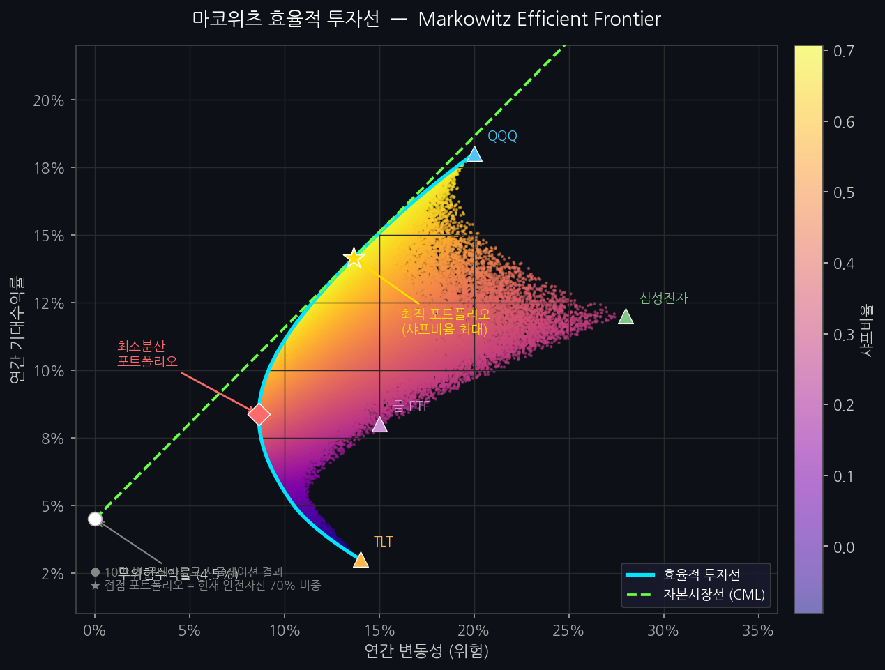

# 퀀트 자동매매 시스템

> **투자 책임 고지**: 이 프로그램은 교육 및 연구 목적으로 제작되었습니다.  
> 실제 투자 손익에 대한 책임은 전적으로 사용자 본인에게 있습니다.  
> 과거 성과가 미래 수익을 보장하지 않습니다.

---

## 포트폴리오 구조

### 70% — 안전자산 (몬테카를로 시뮬레이션 최적화)

| 자산 | 비중 | 설명 |
|------|------|------|
| QQQ | 22.3% | 나스닥 100 ETF |
| 삼성전자 (005930.KS) | 27.3% | 국내 대형주 |
| TLT | 0.2% | 미국 장기채 ETF |
| ACE KRX금현물 (411060.KS) | 50.3% | 금 ETF |

- 최신 5개년 데이터 기반 몬테카를로 시뮬레이션 10만 번 → **최대 샤프비율** 비중 도출
- 매월 1일 08:30 자동 리밸런싱 (LLM이 주식 수량 결정)

### 30% — 급등주 (듀얼 에이전트 ML 전략)

- **돌파 에이전트** (`_momentum.pkl`) + **눌림목 에이전트** (`_reversion.pkl`) 2개 XGBoost 모델 병렬 운용
- 각 에이전트는 **트리거 종류에 맞는 과거 행만 필터링**하여 학습 → 상황별 특화 예측
- **EOD(장 마감 후) 완성 일봉** 기준으로 신호 탐지 → 익일 시초가에 자동 매수 예약 (Train/Serve Skew 해소)
- 신호 발생 시 **pending_orders 등록** → 09:00(KR) / 22:30·23:30(US) 장 시작 시 자동 실행
- 진입 조건 (5중 필터):
  1. **시장 상황 필터** — KOSPI 역배열(MA5 < MA20) 시 신규 매수 전면 차단
  2. 기술적 트리거 **1개 이상** 충족
  3. 해당 트리거 유형 에이전트 **AUC ≥ 0.58** (동전던지기 수준 모델 차단)
  4. **승률 ≥ 60%** (Platt Scaling 캘리브레이션 적용)
  5. **기대값 손익비 ≥ 1.5** — 약세장(KOSPI < MA20 OR RSI < 35)에서는 `avg_win × 0.4` 적용하여 자동 엄격화
- 두 에이전트 모두 조건 충족 시 **win_prob이 높은 에이전트 선택**
- 포지션 사이징: **하프켈리 + 리스크동등화** (`min(켈리 qty, 총자산 1% ÷ 2×ATR)`)
- 07:30 **KRX 상위 200 유니버스 재학습** / 22:30·23:30 **US 상위 100 유니버스 재학습** (서머/동절기 자동 분기)

---

## ML 전략 상세

### 유니버스 스크리닝 (1단계)

| 시장 | 방법 | 조건 |
|------|------|------|
| 한국 | **FinanceDataReader** KOSPI+KOSDAQ 전체 | 등락률 > 0% + 거래대금 상위 100개 |
| 미국 | S&P 500 전체 (503종목) | 등락률 > 0% + 거래량 비율 × 1.5 이상 상위 50개 |

- 거래량은 **한국(KST 09:00~15:30) / 미국(ET 09:30~16:00)** 장 시간 기준으로 하루 예상 거래량 환산
- 구조적 하락 종목은 **블랙리스트**(`BLACKLIST`)로 영구 제외

### 기술적 트리거 (2단계)

| 신호 | 조건 |
|------|------|
| 거래량폭발 | 예상 하루 거래량 > 20일 평균 × 2.0배 + 양봉 |
| BB하단반등 | 종가가 볼린저밴드 하단 이탈 후 재진입 |
| RSI과매도탈출 | RSI 30 이하에서 30 돌파 |
| 이격도저점 | EMA20 대비 -5% 이하 이격 |
| BB스퀴즈돌파 | 밴드 수축(60일 최저) 후 상단 돌파 |

> 5가지 중 **1개 이상** 충족 시 ML 예측 단계로 진입. 주 품질 필터는 AUC ≥ 0.58 + 승률 ≥ 60%  
> **EOD 완성 일봉** 기준으로 트리거 탐지 (장중 분봉 합성 없음 — 학습 시점과 동일한 피처로 Train/Serve Skew 제거)

### 듀얼 에이전트 ML 예측 (3단계)

트리거 유형에 따라 전용 에이전트 모델을 라우팅합니다.

| 에이전트 | 담당 트리거 | 학습 데이터 |
|---------|-----------|-----------|
| 돌파 에이전트 (`_momentum.pkl`) | 거래량폭발, BB스퀴즈돌파 | 과거 5년 중 해당 트리거 발생일만 필터링 |
| 눌림목 에이전트 (`_reversion.pkl`) | BB하단반등, RSI과매도탈출, 이격도저점 | 과거 5년 중 해당 트리거 발생일만 필터링 |

두 에이전트 모두 조건 충족 시 → **win_prob 높은 쪽 선택 후 매수**

```
트리거 감지
  ├── 거래량폭발 / BB스퀴즈돌파 → 돌파 에이전트 예측
  ├── BB하단반등 / RSI과매도탈출 / 이격도저점 → 눌림목 에이전트 예측
  └── 양쪽 모두 발생 → 두 예측 중 win_prob 최고값 선택
```

**XGBoost 피처 (16종)**

`change_rate`, `volume_change`, `rsi`, `ema_deviation_20`, `bb_width_20`, `bb_pct_20`, `bb_std_20`, `volume_ratio`, `candle_body`, `candle_upper_wick`, `candle_lower_wick`, `ret_3d`, `ret_5d`, `ret_10d`, `volatility_10d`, `atr_pct`

> `atr_pct` = ATR(14) / Close — 가격 정규화 변동성 피처. 종목별 변동성 구간을 모델이 직접 학습.

**라벨링**: Triple-Barrier (López de Prado 방식) — G1 그리드 채택 (2026-06-10)

| 배리어 | 조건 | 결과 |
|--------|------|------|
| 상단 TP | 장중 High ≥ 진입가 × 1.15 (+15%) | label=1 (성공) |
| 하단 SL | 장중 Low ≤ 진입가 × 0.94 (−6%) | label=0 (실패) |
| 시간 | 7거래일 경과 후 종가 기준 | 종가 ≥ 진입가 → 1, 미만 → 0 |

> 같은 날 TP·SL 동시 터치 → SL 우선 (보수적 가정).  
> G1 그리드 (20조합 walk-forward) 채택 결과: KR 백테스트 EV **+1.468%** (슬리피지 0.05% 기준).

**학습 데이터**: 5년치 일봉 / 매일 07:30 KRX 200 + US 100 유니버스 종목 병렬 재학습 (momentum·reversion 에이전트 각각)

**신호 확정 조건 (6중 필터)**

| 필터 | 기준 | 설명 |
|------|------|------|
| 시장 상황 | KOSPI MA5 > MA20 | 역배열(하락장) 시 신규 매수 전면 차단 |
| MA200 추세 | 종가 ≥ 200일 이동평균 | 하락 추세 종목 매수 신호 차단 (Phase 4) |
| 모델 AUC | ≥ 0.58 | OOF AUC 0.5 = 동전던지기, 0.58 이상만 신뢰 |
| 승률 | ≥ 60% | Platt Scaling 캘리브레이션 적용 후 Triple-Barrier 달성 확률 |
| 기대값 손익비 | ≥ 1.5 | `(avg_win_eff × win_prob) / (avg_loss × (1−win_prob))` — 약세장 시 avg_win × 0.4 적용 |
| 트리거 수 | 1개 이상 | AUC·승률 기준이 주 필터, 트리거는 진입 조건 |

기존 단순 손익비(`avg_win / avg_loss`)는 승률과 무관한 고정값이었으나,  
**기대값 손익비**는 승률이 낮을수록 자동으로 기준이 엄격해지는 구조입니다.

**Platt Scaling 확률 캘리브레이션**  
XGBoost의 `predict_proba()`는 내부적으로 확률을 0.5 방향으로 수축시키는 경향이 있어, 실제 승률 60%인 케이스를 0.55로 과소 예측합니다. 학습 후 마지막 TimeSeriesSplit fold 검증 데이터를 이용해 Sigmoid 회귀(Platt Scaling)로 후보정하면 예측 확률이 실제 결과 분포와 일치합니다.

### 하프켈리 + 리스크동등화 포지션 사이징

```
풀켈리: f* = (p × b - q) / b
하프켈리: f = f* × 0.5  ← 실제 적용값

p = ML 예측 승률
b = 평균 수익 / 평균 손실 (손익비)
q = 1 - p
```

풀켈리는 입력값(승률·손익비) 추정 오차에 민감하므로 하프켈리로 완충합니다.

**리스크동등화(Risk Parity) 연동**

ATR 기반 손절 폭이 종목마다 달라지므로, 손실 시 전체 자산의 1%가 일정하도록 수량을 역산합니다.

```
리스크동등화 qty = 총자산 × 1% ÷ (2 × ATR(14))
최종 qty = min(하프켈리 qty, 리스크동등화 qty)
```

변동성이 낮은 종목(ATR 작음) → 더 많은 수량, 변동성이 높은 종목(ATR 큼) → 더 적은 수량으로 종목 간 실질 리스크가 균등해집니다.

---

## 알고리즘 선택 근거

### XGBoost + TimeSeriesSplit

#### XGBoost를 선택한 이유

XGBoost(Extreme Gradient Boosting)는 결정 트리를 순차적으로 앙상블하는 부스팅 계열 모델입니다.  
주가 데이터에 적합한 이유는 세 가지입니다.

1. **비선형 패턴 포착** — 거래량 급등·RSI 과매도탈출·볼린저밴드 수축 등 기술적 신호는 선형 관계가 아닙니다. 트리 기반 모델은 이런 임계값(threshold) 조건을 자연스럽게 학습합니다.
2. **피처 스케일 무관** — MA이격도(%), RSI(0~100), 거래량비율(배수)처럼 단위가 제각각인 15개 피처를 정규화 없이 그대로 사용할 수 있습니다.
3. **클래스 불균형 대응** — 7일 후 +3% 이상 수익을 내는 케이스는 전체 데이터의 일부입니다. `scale_pos_weight = (양성 외 비율) / 양성 비율`로 소수 클래스에 가중치를 부여해 편향을 보정합니다.

재학습은 KR/US를 분리해 각 장 시작 직전에 실행합니다. KRX는 07:30(한국장 09:00 전), US는 22:30·23:30 양쪽에 등록하되 내부에서 ET 09:30~10:00 창을 체크해 서머타임·동절기 중 딱 한 번만 실행됩니다. XGBoost는 GPU 없이도 8스레드 병렬로 150종목을 수십 분 내에 처리할 수 있습니다.

#### TimeSeriesSplit을 선택한 이유

일반적인 k-fold 교차검증은 **데이터를 무작위로 섞어** 학습셋/검증셋을 구성합니다.  
주가 데이터에 이를 적용하면 **미래 데이터로 과거를 예측**하는 데이터 누수(data leakage)가 발생해 검증 지표가 과도하게 낙관적으로 나옵니다.

```
일반 k-fold (잘못된 방식)
  Fold 1:  [──val──][──────train──────][──────train──────]
  Fold 2:  [──────train──────][──val──][──────train──────]
                                          ↑ 미래가 과거 학습에 포함

TimeSeriesSplit (올바른 방식)
  Fold 1:  [──────train──────][──val──]
  Fold 2:  [────────────train────────][──val──]
  Fold 3:  [──────────────────train──────────][──val──]
                     과거 → 미래 방향만 허용
```

`TimeSeriesSplit(n_splits=5)`은 각 fold마다 학습 구간을 순차적으로 확장하면서 검증 구간은 항상 미래에 위치합니다. 실전 운용과 동일한 조건에서 성능을 평가하므로 OOF(Out-of-Fold) 지표가 실제 예측력을 신뢰성 있게 반영합니다.

---

### 마코위츠 효율적 투자선과 몬테카를로 시뮬레이션

#### 마코위츠 효율적 투자선이란



해리 마코위츠(Harry Markowitz)의 현대 포트폴리오 이론(MPT, 1952)은 **분산투자로 동일한 기대수익률을 더 낮은 위험으로 달성할 수 있다**는 것을 수학적으로 증명했습니다.

자산들의 기대수익률, 분산, 상관관계를 고려하면 가능한 포트폴리오 집합에서 두 종류의 경계가 존재합니다.

- **최소분산 프론티어**: 각 기대수익률 수준에서 분산이 가장 작은 포트폴리오의 집합
- **효율적 투자선(Efficient Frontier)**: 최소분산 프론티어 중 기대수익률이 더 높은 상반부 — 이 선 위의 포트폴리오만이 합리적 선택입니다

이 중 무위험수익률을 고려했을 때 **샤프비율(초과수익 / 변동성)이 최대**인 접점 포트폴리오가 이론적으로 최적 위험자산 배분입니다.

#### 해석적 풀이 대신 몬테카를로를 사용하는 이유

MPT의 해석적 풀이는 공분산 행렬의 역행렬 계산을 요구합니다. 이론적으로 완전하지만 실제 적용에는 한계가 있습니다.

| 한계 | 내용 |
|------|------|
| 수익률 분포 가정 | 해석적 풀이는 정규분포를 가정하지만, 주가 수익률은 팻테일(fat tail)과 비대칭성을 보입니다 |
| 비선형 제약 | 비중 합계 = 1, 비중 ≥ 0(공매도 금지) 같은 제약을 추가하면 볼록 최적화 문제가 복잡해집니다 |
| 소표본 불안정성 | 공분산 행렬 추정 오차가 역행렬 계산에 증폭되어 극단적 비중이 나올 수 있습니다 |

몬테카를로 시뮬레이션은 **10만 번 무작위 비중을 샘플링**해 각각의 샤프비율을 계산한 뒤 최댓값을 취합니다.

```python
# rebalancer.py 핵심 로직
returns = prices.pct_change().dropna()
mean_ret = returns.mean()
cov = returns.cov()

best_sharpe, best_weights = -np.inf, None
for _ in range(100_000):
    w = np.random.dirichlet(np.ones(n))          # 비중 합계 = 1 자동 보장
    port_ret = mean_ret @ w * 252                # 연환산 수익률
    port_vol = np.sqrt(w @ cov @ w * 252)        # 연환산 변동성
    sharpe   = (port_ret - RISK_FREE_RATE) / port_vol
    if sharpe > best_sharpe:
        best_sharpe, best_weights = sharpe, w    # 효율적 투자선 접점 추적
```

이 방식은 정규분포 가정 없이 실제 수익률 분포를 반영하고, 공매도 금지 제약이 Dirichlet 샘플링으로 자연스럽게 충족되며, 구현 복잡도가 낮아 매월 재실행하기에 적합합니다.

---

### 풀켈리 vs 하프켈리

#### 켈리 공식이란

켈리 공식은 반복적인 베팅에서 **장기 자산의 기하평균 성장률을 최대화**하는 최적 베팅 비율을 도출합니다.

```
풀켈리:   f* = (p × b - q) / b

  p = 승률 (win probability)
  b = 손익비 = 평균 수익률 / 평균 손실률
  q = 1 - p (패배 확률)
```

예를 들어 승률 60%, 손익비 2.0이면 `f* = (0.6 × 2 - 0.4) / 2 = 0.4` → 자산의 40%를 베팅합니다.

#### 풀켈리의 문제점

풀켈리는 이론적으로 최적이지만, **입력값이 정확히 알려져 있다는 전제** 위에 성립합니다.

이 시스템에서 `p`(승률)와 `b`(손익비)는 XGBoost가 과거 데이터에서 학습한 **추정값**입니다. 실제 미래 시장에서 이 수치가 정확히 재현된다는 보장이 없습니다.

| 시나리오 | 결과 |
|----------|------|
| 추정 승률 0.60 → 실제 0.52 | 풀켈리 과다 베팅 → 드로다운 급증 |
| 손익비 과대 추정 | 손실 시 포트폴리오 급감 |
| 연속 손실 구간 | 풀켈리는 기하평균 최적이나 심리적 감내 한계 초과 |

#### 하프켈리를 사용하는 이유

```
하프켈리:  f = f* × 0.5
```

하프켈리는 수학적으로 다음 특성을 가집니다.

- **드로다운** 크기: 풀켈리 대비 약 **75% 수준**으로 감소
- **장기 성장률**: 풀켈리 대비 약 **75% 수준** 유지
- **입력 오차 민감도**: 추정값이 실제와 달라도 손실 폭이 크게 줄어듦

즉, 성장률을 25% 포기하는 대신 드로다운 위험을 25% 줄이는 거래입니다. ML 모델의 추정 오차가 필연적으로 존재하는 환경에서 이 완충은 전략 지속성을 유지하는 데 중요합니다.

실제 적용에는 최대 **20% 한도**도 추가로 적용됩니다(`min(f_half, 0.20)`).

```python
# kelly.py
MAX_KELLY = 0.20                 # 단일 포지션 최대 20% 캡
f_full = (win_prob * b - q) / b  # 풀켈리
f_half = f_full * 0.5            # 하프켈리 적용
return round(min(MAX_KELLY, max(0.0, f_half)), 4)
```

---

## 자동화 스케줄

| 시간 | 동작 |
|------|------|
| 07:30 (영업일) | KRX 시가총액 상위 200 유니버스 ML 모델 병렬 재학습 (장외 동작, 5년치 일봉 기반) |
| 22:30 / 23:30 (평일) | S&P 500 상위 100 유니버스 ML 모델 재학습 (서머/동절기 자동 분기, ET 09:30~10:00 창에서만 실행) |
| 08:00 (영업일) | 모닝 브리핑 (보유종목 뉴스 + 시황) |
| 08:30 (매월 1일 영업일) | 안전자산 몬테카를로 리밸런싱 |
| 09:00 (영업일) | KR 예약 주문 실행 — EOD 신호 기반 익일 시초가 매수 |
| **09:05 (영업일)** | **KR 페이퍼 시초가 확정** — `update_entry_prices("KR")` FinanceDataReader로 당일 실제 Open 조회, `entry_price=None` 포지션 확정 |
| 5분 간격 (장중 전체) | ML 포지션 익절·ATR손절·트레일링스톱·7거래일 강제 청산 체크 + 페이퍼 TP/SL 평가 |
| **15:31 (영업일)** | **EOD 신호 스캔** — Close 확정 후 완성 일봉으로 신호 탐지 → 익일 시초가 예약 (GATE B, Train/Serve Skew 해소) |
| 22:30 / 23:30 (평일) | US 예약 주문 실행 — EOD 신호 기반 익일 시초가 매수 (서머/동절기 자동 분기) |
| **22:35 / 23:35 (평일)** | **US 페이퍼 시초가 확정** — `update_entry_prices("US")` (서머/동절기 자동 분기) |
| 15:00 (영업일) | 일일 기술적 분석 리포트 |
| **15:35 (매일)** | **KR 페이퍼 트레이딩 일일 리포트** (한국 증시 마감 직후, 텔레그램 전송) |
| **05:30 / 06:30 (매일)** | **US 페이퍼 트레이딩 일일 리포트** (미국 증시 마감 직후, 서머/동절기 자동 분기, 하루 1회) |

> **영업일 자동 감지**: `market_calendar.py`가 pykrx로 KRX 연간 영업일을 캐시하여 주말 + 공휴일(빨간날) 모두 자동 제외

---

## 봇 활성화 게이트

기존 보유 종목이 있을 경우, 해당 종목을 **직접 모두 매도**해야 자동매매가 시작됩니다.

```
state.json: {"bot_active": false, "legacy_tickers": ["XXXX"], ...}
  ↓ 직접 매도 완료
state.json: {"bot_active": true, ...}  →  자동매매 시작
```

텔레그램 LLM 기능(질문, 브리핑 등)은 봇 활성화 여부와 무관하게 항상 작동합니다.

**텔레그램 제어**

| 명령 | 동작 |
|------|------|
| `/stop` | 자동매매 중단 (`user_stopped=true` 플래그 설정 — 봇 재시작 후에도 유지) |
| `/start` | 자동매매 재개 (`user_stopped=false` 해제) |

> `/stop` 후 `.py` 파일 수정으로 봇이 재시작되어도 `user_stopped` 플래그가 자동 재활성화를 차단합니다.

---

## 미국주식 — 통합증거금서비스

QQQ, TLT 등 미국주식은 **KIS 통합증거금서비스**를 통해 거래합니다.  
원화 잔고에서 자동으로 환전되어 USD 결제가 처리되므로 별도 환전 불필요합니다.

---

## 매매 이력 관리

모든 자동매매 거래는 `trade_history.csv`에 자동 기록됩니다.

| 컬럼 | 설명 |
|------|------|
| trade_id | 거래 고유 ID |
| ticker / name | 종목코드 / 종목명 |
| entry_date / entry_price | 매수일 / 매수가 |
| exit_date / exit_price | 매도일 / 매도가 |
| qty | 수량 |
| pnl_amount / pnl_pct | 손익(원) / 손익률(%) |
| win | 성공(1) / 실패(0) |
| strategy | 사용 전략 |
| win_prob | 매수 시점 ML 예측 승률 (%) |
| avg_win_pct | 모델 학습 기준 평균 수익률 (%) |
| avg_loss_pct | 모델 학습 기준 평균 손실률 (%) |
| model_auc | 매수 시점 모델 OOF AUC |

거래 업데이트마다 CSV 파일을 텔레그램으로 자동 전송합니다.

---

## GPT AI 어시스턴트 (LangGraph ReAct)

`create_react_agent` (langgraph.prebuilt) + `MemorySaver` checkpointer로 유저별 `thread_id` 대화 이력을 분리 관리합니다.  
`/reset` 시 generation 카운터를 증가시켜 새 thread로 전환 (메모리 즉시 초기화).

| 툴 | 용도 |
|----|------|
| `get_naver_finance` | 한국 주식 재무지표 (PER, PBR, EPS 등) |
| `get_yahoo_finance` | 미국 주식 재무지표 |
| `get_naver_news` | 네이버 최신 뉴스 검색 |
| `get_stock_signal` | 기술적 지표 + 매수/매도 신호 분석 |
| `get_historical_price` | 특정 날짜 종목 종가 조회 |
| `get_account_balance` | 국내 + 미국주식 잔고 조회 |
| `get_portfolio_status` | 안전자산 포트폴리오 현황 + 리밸런싱 필요 여부 |
| `set_conditional_order` | 조건부 주문 등록 |
| `list_conditional_orders` | 조건부 주문 목록 조회 |
| `cancel_conditional_order` | 조건부 주문 취소 |
| `list_trade_records` | 매매 이력 조회 (open/closed/all) |
| `edit_trade_record` | 매매 이력 수정 (진입가·청산가·수량 등) |

툴을 사용한 답변에는 **Context Recall 점수**(0.0~1.0)가 자동 표시됩니다 (gpt-5.4-mini 평가).

---

## 텔레그램 명령어

| 명령어 | 설명 |
|--------|------|
| 자유 텍스트 | LangChain AI 어시스턴트 자동 답변 |
| `/ask <질문>` | GPT 명시적 질문 |
| `/reset` | 대화 기록 초기화 |
| `/status` | 전 종목 신호 조회 |
| `/balance` | 국내 + 미국주식 잔고 조회 |
| `/portfolio` | 안전자산 70% 포트폴리오 현황 |
| `/scanstocks` | 급등주 ML 신호 수동 스캔 |
| `/buysignal_TICKER` | 스캔 신호 매수 확정 |
| `/skipsignal` | 대기 신호 패스 |
| `/trainmodel` | ML 모델 전체 재학습 |
| `/tradestats` | 매매 이력 통계 + CSV 전송 |
| `/backtest` | 45일 분봉 ML 백테스트 |
| `/stocks` | 관심종목 목록 |
| `/addstock 코드 이름` | 종목 추가 |
| `/removestock 코드` | 종목 삭제 |
| `/buy 코드 수량` | 수동 매수 |
| `/sell 코드 수량` | 수동 매도 |
| `/sellall 코드` | 전량 매도 |

---

## 전체 아키텍처

```
┌──────────────────────────────────────────────────────────────────────┐
│                  macOS launchd — 3개 데몬 상시 실행                    │
├──────────────┬───────────────────────────┬───────────────────────────┤
│  runner.py   │  telegram_bot.py          │  dashboard.py             │
│  (스케줄러)   │  (사용자 인터페이스)        │  (Streamlit 모니터링)       │
└──────┬───────┴─────────────┬─────────────┴───────────────────────────┘
       │                     │
       │    ┌────────────────▼──────────────────────────────────────┐
       │    │     langchain_agent.py  (LangGraph ReAct + gpt-5.5)    │
       │    │   MemorySaver checkpointer — thread_id 유저별 대화 분리  │
       │    │   12종 툴 자동 호출 + Context Recall 평가 (gpt-5.4-mini)│
       │    └───────────────────────────────────────────────────────┘
       │
       ├── [07:30] ml/trainer.py — KRX 200+US 100 유니버스 XGBoost 병렬 재학습 (momentum·reversion 에이전트 각각)
       │
       ├── [08:00] morning_briefer.py — 보유종목 뉴스 + 시황
       │     LangGraph 품질 재시도 루프: score < 0.7이면 최대 3회 재생성
       │
       ├── [08:30/매월1일] portfolio/rebalancer.py
       │     몬테카를로 10만번 → 최대 샤프비율 비중
       │     → gpt-5.5가 수량 결정 → KIS 주문
       │
       ├── [5분 간격] check_ml_positions() + _run_paper_evaluate_kr()
       │     → ML 포지션 익절·ATR손절·트레일링스톱·7거래일 강제 청산 체크
       │     → 페이퍼 포지션 TP/SL 평가 (KR 장중)
       │
       ├── [15:31] scan_growth_signals_eod()  ← B1 전략: 장중 스캔 → EOD 스캔으로 전환
       │     market_regime.py → KOSPI MA5/MA20/RSI14 시장 상황 판정
       │       ├── 역배열(MA5 < MA20): 신규 매수 전면 차단 (보유 청산만 유지)
       │       └── 약세장(Close < MA20 OR RSI < 35): avg_win × 0.4 패널티 적용
       │     signals/krx_universe.py → FinanceDataReader KOSPI+KOSDAQ 스크리닝 (200개)
       │       ↓ EOD 완성 일봉만 사용 (분봉 합성 없음 — 학습 피처와 동일)
       │     signals/signal_graph.py (LangGraph StateGraph) — 신호 탐지 파이프라인
       │       trigger_detect → (momentum/reversion/both) → select_best → END
       │       ├── 거래량폭발·BB스퀴즈돌파 → 돌파 에이전트 (_momentum.pkl)
       │       ├── BB하단반등·RSI과매도탈출·이격도저점 → 눌림목 에이전트 (_reversion.pkl)
       │       └── 양쪽 조건 충족 시 → win_prob 최고 에이전트 선택
       │       ↓ Platt Scaling (AUC≥0.58 AND 승률≥60% AND 기대값 손익비≥1.5)
       │     → 텔레그램 인라인 키보드로 매수 확인 요청 (✅확인 / ❌취소)
       │       ✅ 확인 시 → pending_orders 등록 → 익일 09:00 시초가 매수
       │       ❌ 취소 시 → 주문 파기  (매도는 check_ml_positions에서 자동 처리)
       │
       ├── [15:00] send_daily_summary() — 일일 기술적 분석 리포트
       ├── [15:35] paper_trader.daily_report(market="KR") — KR 페이퍼 일일 리포트
       └── [05:30·06:30] paper_trader.daily_report(market="US") — US 페이퍼 일일 리포트 (하루 1회)

공통 레이어:
  KIS API (한국 실시간 현재가·주문·잔고)  ·  yfinance ≥1.2 (일봉·미국 5분봉, MultiIndex 대응)
  FinanceDataReader (KRX 유니버스 스크리닝)  ·  ml/models/*.pkl
  trade_history.csv  ·  state.json
```

> **yfinance 1.2+ 호환**: `group_by` 파라미터 제거, MultiIndex 컬럼 `xs(ticker, level=1)` 방식으로 접근.
> 일봉 및 분봉 df에 중복 컬럼/인덱스 방어 코드(`duplicated()` 제거) 적용.

---

## 프로젝트 구조

```
quant_trader/
├── config.py               # 전략 파라미터 / API 설정
├── stocks.py               # 관심종목 (STOCKS, US_STOCKS)
├── runner.py               # 스케줄러 (07:30 재학습·스캔·리밸런싱·09:05/22:35/23:35 시초가 업데이트)
├── telegram_bot.py         # 텔레그램 봇
├── langchain_agent.py      # LangGraph ReAct AI 어시스턴트 (MemorySaver, thread별 대화 이력)
├── pending_confirmations.py # EOD 매수 신호 확인 대기 목록 (인라인 키보드 ✅/❌)
├── trader.py               # KIS API (국내 + 미국주식)
├── trade_logger.py         # 매매 이력 CSV 기록 + 텔레그램 전송
├── backtest_ml.py          # 45일 분봉 ML 백테스트
├── backtest_walkforward.py # Walk-forward 백테스트 (비용 반영, 실거래 게이트)
├── paper_trader.py         # 페이퍼 트레이딩 엔진 (KR+US, 2단계 체결, Circuit Breaker, P4 게이트, 일일 리포트)
├── position_manager.py     # ML 포지션 추적 및 봇 활성화 상태 관리 (runner.py에서 분리)
├── tests/
│   ├── test_triple_barrier.py      # Triple-Barrier 라벨링 단위 테스트
│   ├── test_paper_trader.py        # 페이퍼 트레이딩 엔진 단위 테스트 (60케이스, V8 2단계 체결 포함)
│   └── test_position_manager.py    # ML 포지션 추적 단위 테스트 (20케이스)
├── morning_briefer.py      # 모닝 브리핑 (LangGraph 품질 재시도 루프)
├── data_fetcher.py         # yfinance 일봉 + KIS 분봉
├── indicators.py           # MA / RSI / 볼린저밴드
├── strategy.py             # MA/RSI 매수·매도 신호
├── notifier.py             # 텔레그램 메시지 빌더
├── news_fetcher.py         # 네이버 뉴스 API
├── naver_finance.py        # 네이버 증권 재무지표 스크래핑
├── conditional_orders.py   # 조건부 주문 (가격/수익률 조건)
├── market_calendar.py      # KRX 영업일 캐시 (주말+공휴일 자동 감지)
├── market_regime.py        # KOSPI 시장 상황 필터 (역배열 차단 / 약세장 판정)
├── gpt_agent.py            # GPT 툴 함수 (langchain_agent에서 호출)
├── signals/
│   ├── signal_graph.py     # LangGraph StateGraph 신호 탐지 파이프라인
│   ├── scanner.py          # 기술적 트리거 탐지 + ML 에이전트 평가 (signal_graph에서 호출)
├── state.json              # 봇 활성화 게이트
├── trade_history.csv       # 매매 이력
├── ml/
│   ├── features.py         # 피처 엔지니어링 (16종, atr_pct 포함) + Triple-Barrier 라벨링 + 에이전트 트리거 필터
│   ├── model.py            # XGBoost 학습·예측 (agent="" | "momentum" | "reversion")
│   ├── trainer.py          # KRX+US 유니버스 병렬 재학습 (8스레드, 5년치, 에이전트별)
│   └── models/             # {ticker}_momentum.pkl / {ticker}_reversion.pkl
├── signals/
│   ├── scanner.py          # 기술적 트리거 + ML 예측 (블랙리스트 적용)
│   ├── krx_universe.py     # KRX 전체 종목 1차 스크리닝
│   ├── us_universe.py      # S&P 500 전체 종목 1차 스크리닝 (ET 거래량 환산)
│   └── alert.py            # 급등주 신호 알림 메시지
├── portfolio/
│   ├── kelly.py            # 켈리 공식 포지션 사이징
│   ├── safe_portfolio.py   # 안전자산 비중 추적
│   └── rebalancer.py       # 몬테카를로 리밸런싱
├── logs/
│   └── trader.log
├── com.quant.trader.plist
├── com.quant.telegrambot.plist
└── com.quant.dashboard.plist
```

---

## Walk-forward 백테스트 (비용 반영)

`backtest_walkforward.py` — 실투자 전 게이트 검증용. 비용 차감 후 기대값이 양수일 때만 실거래 재개.

**구조**: 2년 학습 창 / 3개월 테스트 창 / 3개월 슬라이딩

**비용 모델 (왕복)**

| 항목 | 비율 |
|------|------|
| 수수료 (매수+매도) | 0.03% |
| 슬리피지 (익일 시초가 지정가) | 0.05% |
| 증권거래세 (KRX만) | 0.18% |
| **KRX 총 비용** | **0.26%** |

**G1 그리드 채택 결과** (KR, 2026-06-10)

| 항목 | Phase 4 (TP=7%/SL=7%) | **G1 채택 (TP=15%/SL=6%)** |
|------|----------------------|--------------------------|
| 슬리피지 | 0.25% | **0.05%** (익일 시초가 지정가) |
| KRX 총 비용 | 0.46% | **0.26%** |
| 세후 EV | +1.019% | **+1.468%** |
| TP 청산 비율 | — | 27% (기간만료 수익 개선이 EV 상승 주원인) |
| 기간만료 평균 수익 | +0.140% | **+2.529%** |

> 20조합 walk-forward 그리드 탐색 → EV 최고 조합 G1(TP=15%/SL=6%) 채택.  
> US 백테스트는 미검증 상태 — 탐색적 운용 (`PAPER_BACKTEST_EV_US = None`).

```bash
python3 backtest_walkforward.py
```

출력 예시:
```
✅ 게이트 통과 — 실거래 재개 가능
❌ 게이트 미통과 — 비용 차감 후 엣지 없음. 실거래 재개 불가
```

---

## 페이퍼 트레이딩 (`paper_trader.py`)

실거래 전 2주 페이퍼 검증 단계. `LIVE_TRADING=False` 상태에서만 동작하며 실 API 호출 없음.

**설계 원칙**
- 체결가·비용 모두 `backtest_walkforward._apply_costs()` 공유 → 백테스트와 수치 완전 일치
- 신호 발생 시점·체결가 가정·청산 시점 임의 조정 금지 (편향 없는 측정)
- **2단계 체결 구조**: 신호 발생 시 `entry_price=None` + `eod_close`(전일 종가) 기록 → 익일 장 시작 후 FinanceDataReader로 실제 시초가(Open) 조회하여 확정. 확정 전까지 청산 체크 스킵.

**주요 기능**

| 기능 | 설명 |
|------|------|
| P1 신호 기록 | `log_paper_signal()` — 신호 발생 시 종목·EOD 종가 기록 (`entry_price=None`으로 2단계 대기) |
| P1-2 시초가 확정 | `update_entry_prices(market)` — 09:05 KST(KR) / ET 09:35(US) 실제 Open 조회 후 `entry_price` 업데이트, 갭 슬리피지 계산 |
| P2 지표 산출 | `get_metrics(market=None)` — KR/US/전체 분리 EV·승률·CI·연속손실 계산 |
| P3 Circuit Breaker | 6개 조건 자동 감시 (EV ≤ −0.5%, CI 하단 < −1%, 연속손실 8건 등) |
| P4 게이트 평가 | `evaluate_live_gate()` — 60일·50건·EV≥0.3%·AUC≥0.55 등 실거래 진입 체크리스트 |
| 일일 리포트 | KR: **15:35**, US: **05:30/06:30** 텔레그램 자동 전송 |
| 주차별 요약 | 일요일 20:00 자동 전송 |

**Circuit Breaker 조건 (P3)**

| CB | 조건 | 발동 기준 |
|----|------|---------|
| CB1 | 페이퍼 EV | n≥30 시 EV ≤ −0.5% |
| CB2 | CI 하단 | n≥50 시 95% CI 하단 < −1.0% |
| CB3 | 연속 손실 | 최대 연속 손실 ≥ 8건 |
| CB4 | 백테스트 갭 | n≥30 시 페이퍼 EV − 백테스트 EV ≤ −1.0%p |
| CB5 | 슬리피지 | 실측 평균 슬리피지 > 0.50% |
| CB6 | AUC | 분기 평균 AUC < 0.45 |

**P4 실거래 게이트 기준**

| 항목 | 기준 |
|------|------|
| 페이퍼 운영 기간 | ≥ 60 거래일 |
| 누적 청산 건수 | ≥ 50건 |
| 세후 EV | ≥ +0.30% |
| 95% CI 하단 | > 0% |
| 승률 | ≥ 52% |
| 실측 슬리피지 | < 0.40% |
| 종목 집중도 | < 30% |
| 연속 손실 최대 | ≤ 5건 |
| 레짐 AUC 평균 | ≥ 0.55 |

> 현재 상태: **2주 페이퍼 진행 중** (시작 2026-06-10, G1 파라미터 적용).  
> KR 백테스트 EV = **+1.468%** / US = 탐색적 운용 (기준 없음)

---

## 백테스트 결과 (참고)

**45일 분봉 기반 백테스트** (2026-04-11 ~ 2026-05-26, KRX 200 + S&P 500 100 = 300종목)  
조건: AUC ≥ 0.58, 승률 ≥ 0.60, 기대값 손익비 ≥ 1.5 (Platt Scaling 캘리브레이션 미적용 시)

| 종목 | 거래 | 승률 | 손익비 | 평균 수익 |
|------|------|------|--------|---------|
| 원익IPS (240810.KQ) | 1건 | 100.0% | — | +14.46% |
| 한진칼 (180640.KS) | 1건 | 100.0% | — | +10.10% |
| HD현대 (267250.KS) | 1건 | 100.0% | — | +4.01% |
| 한국전력 (015760.KS) | 2건 | 50.0% | 2.09 | +2.70% |
| 태성 (323280.KQ) | 4건 | 25.0% | 8.92 | +7.13% |

**종합: 38건 | 신호 발생 16종목 (KRX 위주)**

> Platt Scaling 캘리브레이션 적용 후 승률 ≥ 0.60 기준 더 많은 신호 생성 예상  
> 분봉으로 장중 신호 감지 → 다음 봉 시가 매수 → 아래 조건으로 자동 청산

### 자동 청산 조건 (5분마다 체크)

| 조건 | 기준 | 알림 |
|------|------|------|
| ✅ 익절 | 현재가 ≥ 매수가 × (1 + avg_win) | "익절" |
| 🔴 ATR 손절 | 현재가 ≤ 매수가 − 2 × ATR(14) | "ATR손절" |
| 📉 트레일링 스톱 | 수익 구간 진입 후 고점 대비 −2.5% 또는 −1×ATR 하락 | "트레일링스톱" |
| ⏰ 기간 청산 | 매수 후 7 **KRX 거래일** 경과 (공휴일 제외) | "기간 청산" |

> **ATR 손절**: 고정 -7% 대신 종목 변동성에 맞춘 맞춤형 손절. ATR이 크면 손절 폭도 넓어져 휩쏘 손절을 줄입니다.  
> **트레일링 스톱**: 수익권 진입 후 고점을 추적하여 수익을 보존합니다. 손절가보다 항상 느슨하지 않도록 동작합니다.

---

## 설치

```bash
git clone https://github.com/sonjong980304-tech/quant_trader-.git
cd quant_trader
bash install.sh
```

---

## API 키 설정 (.env)

```
KIS_APP_KEY=...
KIS_APP_SECRET=...
KIS_ACCOUNT_NO=...        # 계좌번호 (예: 12345678-01)
KIS_MOCK=true             # 모의투자: true / 실투자: false
TELEGRAM_BOT_TOKEN=...
TELEGRAM_CHAT_ID=...
OPENAI_API_KEY=...
NAVER_CLIENT_ID=...
NAVER_CLIENT_SECRET=...
```

---

## 실행

```bash
# ML 모델 학습 (최초 1회 또는 /trainmodel 명령)
python3 ml/trainer.py

# 장중 스케줄러 (07:30 자동 재학습 포함)
python3 runner.py

# 텔레그램 봇
python3 telegram_bot.py

# 45일 분봉 백테스트
python3 backtest_ml.py
```

---

## 주의사항

1. `.env` 파일은 절대 GitHub에 커밋하지 마세요.
2. KIS_APP_KEY 미설정 시 자동으로 시뮬레이션 모드로 동작합니다.
3. ML 모델은 최초 실행 전 반드시 `/trainmodel` 또는 `python3 ml/trainer.py`로 학습이 필요합니다.
4. 모의투자로 충분히 검증 후 실투자로 전환하세요.

---

## 라이선스

MIT License — 개인 교육 및 연구 목적으로만 사용하세요.
